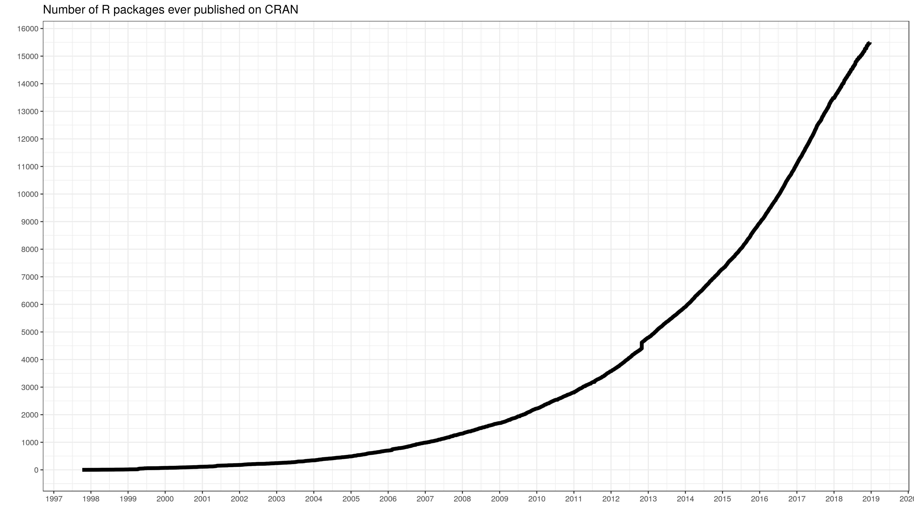
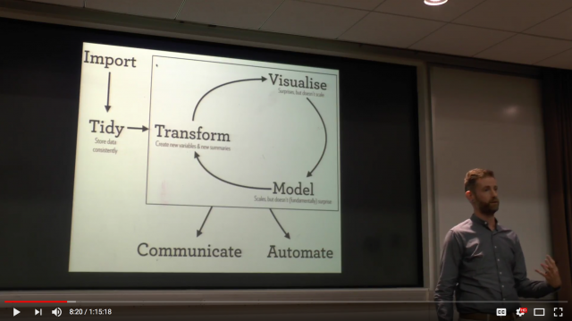

```{r setup, include=FALSE}
options(htmltools.dir.version = FALSE)
```


# About Me

- Studied at **Government College of Technology, Coimbatore**

- Bengaluru R user group **Organizer**

- R Packages Developer ( `coinmarketcapr`, `itunesr`)


---

class: inverse

# Disclaimer:

- This workshop is **NOT** going to make you a Data Scientist **in a day**. 

- The objective is to help you get a flavor of R and how it is used in Data Science

- Thus, get you ready to embark on your own journey to become a Data Scientist who uses R


---

# Content:

This presentation's content is heavily borrowed from the book [**R for Data Science**](https://r4ds.had.co.nz) by **Garrett Grolemund** and **Hadley Wickham**


.center[]

---


# About R

- R is a language and environment for statistical computing and graphics. (Ref: [`r-project.org`](https://www.r-project.org/about.html))

- R was created by Ross Ihaka and Robert Gentleman at the University of Auckland, New Zealand

- R is Free

- R can be extended (easily) via *packages*.

- R is an interpreted language


.right[]


---
class: inverse, center, middle

# R Interpreter / Console / GUI
## Demo
---

# About RStudio


- RStudio is a **free and open-source IDE** for R, released by the company **RStudio, Inc.** 

- RStudio and its team regularly contribute to R community by releasing new packages, such as:
  - `tidyverse`
  - `shiny`
  - `knitr`


.right[]


---
class: inverse, center, middle

# RStudio
## Demo


---

# R Ecosystem

Like `Python`, `R`'s strength lies in its Ecosystem. **Why R?** - R Packages


### Growth


<figure>
    
      <font size="2">
        <figcaption> Source: <a href ="https://gist.github.com/daroczig/3cf06d6db4be2bbe3368">@daroczig</a>
        </figcaption>
      </font>
</figure>

---
class: inverse, center, middle

# Basics of R Programming

---

# Hello, World!


The traditional first step - **Hello, World!**:

--

```{r eval=TRUE, tidy=FALSE}
print("Hello, World!") #<<
 
```

<br/>

###.center[That's one small step for a man, one giant leap for mankind]
###.center[Neil Armstrong]

---

# Arithmetic Operations

```{r}
2 + 3
```

```{r}
50000 * 42222
```

```{r}
2304 / 233
```

```{r}
(33 + 44 ) * 232 / 12
```

---

# Assignment Operators

### .center[`<-` **Arrow (Less-than < and Minus - )**]

### .center[`=` **(Equal Sign)**]

```{r}
(x <- 2 + 3)
```


```{r}
(y = x ** 4) #<<
```

```{r}
5 * 9 -> a
a + 3
```

---


# Objects

* The entities R operates on are technically known as `objects`.

Example: Vector of numeric


```{r}
vector_of_numeric <- c(2,4,5)

typeof(vector_of_numeric)
```

---

# Vectors

- Atomic Vectors - Homogeneous Data Type

  - logical
  - integer
  - double
  - character
  - *complex*
  - *raw*

- Lists - (Recursive Vectors) Heterogeneous Data Type 

- `NULL` is used to represent absence of a vector

**Vectors + Attributes (Additional Meta Data) = Augmented vectors**

* Factors are built on top of integer vectors.
* Dates and date-times are built on top of numeric vectors.
* Data frames and tibbles are built on top of lists.


---

### Numeric Vector

```{r}
nummy <- c(2,3,4)

nummy_int <- c(1L,2L,3L)  
```


```{r}
typeof(nummy)

typeof(nummy_int)
```

```{r}
is.numeric(nummy)
is.numeric(nummy_int)

is.double(nummy)
is.double(nummy_int)
```


---

### Character Vector

```{r}

types <- c("int","double","character")

types
```


```{r}
typeof(types)

length(types)

```

```{r}
is.numeric(types)
is.character(types)
```
---

### Logical Vector

```{r}

logicals <- c(TRUE,F,TRUE,T, FALSE)

logicals
```
---

# Coersion 

## Typecasting - Explicit


```{r}

money_in_chars <- c("20","35","33")

typeof(money_in_chars)

```

```{r}
money_money <- as.numeric(money_in_chars)

money_money

typeof(money_money)
```

---

## Typecasting - Implicit

```{r}
money_money <- as.numeric(money_in_chars)

money_money

typeof(money_money)

```

```{r}

new_money <- c(money_money,"33")

new_money

typeof(new_money)

```


---

#Vector - Accessing

```{r}

month.abb #in-built character vector with Month Abbreviations

month.abb[2]

```

```{r}
month.abb[4:7]
```

```{r}
month.abb[c(2,5,7,10)]
```

---
# Vector Manipulation

## Appending

```{r}
days <- c("Mon","Tue","Wed")

days
```

```{r}
week_end <- c("Sat","Sun")

more_days <- c(days,"Thu","Fri",week_end)

more_days
```

---

# Vector - Arithmetic

```{r}

set.seed(122)

so_many_numbers <- runif(10, min = 10, max = 100)

so_many_numbers
```

```{r}
so_many_numbers * 200
```

---
# Factors

* In R, factors are used to work with categorical variables, variables that have a fixed and known set of possible values.

* Useful with Characters where non-Alphabetical Ordering is required

```{r}
days <- c("Thu","Wed","Sun")

sort(days)
```


```{r}

week_levels <- c("Mon","Tue","Wed","Thu","Fri","Sat","Sun")


(days_f <- factor(days, levels = week_levels))

```

```{r}
sort(days_f)  
```

---

# List

Lists are a step up in complexity from atomic vectors: each element can be any type, not just vectors. 

```{r}

(a_list <- list("abcd",123,1:12,month.abb))

```
---

# List Accessing

```{r}
a_list[[1]]

a_list[[4]][4]
```


---

# Matrix

```{r}
new_m <- matrix(data = 1:12, nrow = 3)

new_m
```

```{r}
new_m * 20
```


```{r}
dim(new_m)
new_m[2,3]
```
---
# Dataframe

## Tabular Structure 

* dimension 
* row.names
* col.names


```{r}
colleges <- c("CIT","GCT","PSG")

year <- c(2019,2018,2017)

db <- data.frame(college_names = colleges, year_since = year)

db


```

---
# Dataframe Manipulation

```{r}
db$college_names
```

```{r}
db[2,2] <- 1990

db

```

```{r}
db[,"year_since"]
```

---

# Loops & Iterators

## For Loop

```{r}
for (month_name in month.abb[1:4]) {
  print(paste("This month", month_name, "beautiful!!!"))
}

```

As you move forward, Check the family of `apply` functions - `sapply()`, `tapply()`, `lapply()`, `apply()`.

For advanced functional programming, refer `purrr` package

---

# Logical Operations 

## %in% operator

```{r}

iris$Species %in% "virginica"

```

---

## Logical Operators

```{r}
1:10 > 5
```

```{r}
1:10 == 4
```

```{r}
!1:10 == 4
```

---
# Conditions

```{r}
if (iris$Sepal.Length[2]>5) {
  print("it is gt 5")
} else print("it is not")
```


```{r}
if (iris$Sepal.Length>10) {print("hello")}
```

```{r}
ifelse(iris$Sepal.Length>6, "more_than_10","les_than_10")
```

---

# Functions

## Types

- Base-R functions (`mean()`, `plot()`, `lm()`)
- Package functions (`dplyr::mutate()`, `stringr::str_detect()`)
- User-defined functions 

```{r}
workshop_hate_message <- function(name = "No one", n = 3) {
  text_to_print <- paste(name, "hate(s)", "this workshop")
  for(i in 1:n) {
    print(text_to_print)
  }
  
}

workshop_hate_message("All of us",4)
```


---

# Packages

## Package Installation & Loading

### From CRAN (usually Stable Version)

```{r eval=FALSE}
install.packages("itunesr")
```

**From Github (usually Development Version)**

```{r eval=FALSE}
#install.packages("devtools")
devtools::install_github("amrrs/itunesr")
```

### Loading

```{r eval=FALSE}
library(itunesr)
```

---

# Help

## using `help()`

```{r eval=FALSE}
help("runif")
```

## using ?

```{r eval=FALSE}
?sample
```

---

# Help - Example

```{r}
example("for")
```

---

# Packages Vignette

```{r eval=FALSE}
vignette("dplyr")

browseVignettes("dplyr")
```


 
---
class: inverse, center, middle

# Data wrangling and Visualization using Tidyverse

---
class: center, middle

# Data Science Framework


There are now like, you know, a billion venn diagrams showing you what data science is. But to me I think the definition is pretty simple. Whenever you're struggling with data, trying to understand what's going on with data, whenever you're trying to turn that **raw data into insight and understanding and discoveries**. I think that's **Data Science.**" - Hadley Wickham

<figure>
    
      <font size="2">
        <figcaption> Source: <a href ="https://www.youtube.com/watch?v=cpbtcsGE0OA">Hadley Wickham</a>
        </figcaption>
      </font>
</figure>

---

# Tidyverse


- An opinionated collection of R packages designed for data science. 
- All packages share an underlying design *philosophy, grammar, and data structures*. 

```{r eval=FALSE}
install.packages("tidyverse")
```

### tidyverse packages

```{r}
tidyverse::tidyverse_packages()
```

---

# Loading the Library

```{r}

library(tidyverse)

```


---

# Input Data

Reading the dataset

```{r warning=FALSE, message=FALSE}

#kaggle <- read_csv("data/kaggle_survey_2018.csv")

kaggle <- read_csv("data/kaggle_survey_2018.csv", skip = 1)
```

---

# Basic Stats

### Dimension (Rows Column)

```{r}

dim(kaggle)
```

```{r}
glimpse(kaggle)
```

---

class: inverse, center

# Dataset Overview 
## Demo on RStudio

---

# Data Questions (Business Problem)

- What's the percentage of Male and Female respondents?

- What are the top 5 countries?

---

# dyplr verbs

- `mutate()` - adds new variables that are functions of existing variables
- `select()` - picks variables based on their names.
- `filter()` - picks cases based on their values.
- `summarise()` - reduces multiple values down to a single summary.
- `arrange()` - changes the ordering of the rows.

---

# Introducing %>% Pipe Operator

- The pipe, `%>%`, comes from the magrittr package by Stefan Milton Bache

- **Output of LHS** is given as the **input (first argument) of RHS**

### Example

```{r}

kaggle %>% dim()

```

Although doesn't make much sense to use `%>%` in this context, Hope it explains the function.

---

# Percentage of Male and Female

* Column name - `What is your gender? - Selected Choice`

### Pseudo-code

- `group_by` the `kaggle` dataframe on column `What is your gender? - Selected Choice`
- `count` the values 
-  calculate `percentage` value from the `count`s

---

# % of Male and Female - Group By & Count - Method 1


```{r}
kaggle %>% 
  group_by(`What is your gender? - Selected Choice`) %>% 
  summarise(n = n())
```

---

# % of Male and Female - Group By & Count - Method 2

```{r}
kaggle %>% 
  group_by(`What is your gender? - Selected Choice`) %>% 
  count() 
```

---

# % of Male and Female - Group By & Count - Sorted 

```{r}
kaggle %>% 
  group_by(`What is your gender? - Selected Choice`) %>% 
  count() %>% 
  arrange(desc(n))
```


---

# % of Male and Female - Percentage


```{r}
kaggle %>% 
  group_by(`What is your gender? - Selected Choice`) %>% 
  count() %>% 
  ungroup() %>% 
  mutate(perc = round(n / sum(n),2))
```

---

# % of Male and Female - Nice_Looking_Table


```{r}
kaggle %>% 
  group_by(`What is your gender? - Selected Choice`) %>% 
  count() %>% 
  ungroup() %>% 
  mutate(perc = round(n / sum(n),2)) %>% 
  knitr::kable(format = "html")
```

---

class: inverse,center,middle

# But, Wait!!!
## Go Back and See 
### If you have only `Male` and `Female`?


---

class: inverse,center,middle

# Time for some cleaning
## In the form of `filter()`ing

---

# % of Male and Female - Filtered_Nice


```{r}
kaggle %>% 
  filter(`What is your gender? - Selected Choice` %in% c("Male","Female")) %>% 
  group_by(`What is your gender? - Selected Choice`) %>% 
  count() %>% 
  ungroup() %>% 
  mutate(perc = round(n / sum(n),2)) %>% 
  knitr::kable(format = "html")
```
 

---

class: inverse,center,middle

# An Awkward column name, isn't it??!

---

# % of Male and Female - All_Nice_Table

```{r}
library(scales) #for Percentage Formatting

kaggle %>% 
  filter(`What is your gender? - Selected Choice` %in% c("Male","Female")) %>% 
  group_by(`What is your gender? - Selected Choice`) %>% 
  count() %>% 
  ungroup() %>% 
  mutate(perc = round(n / sum(n),2)) %>% 
  mutate(perc = scales::percent(perc)) %>% 
  rename(Gender = `What is your gender? - Selected Choice`,
         Count = n,
         Percentage = perc) %>% 
  knitr::kable(format = "html")
```

---

# Top 5 Countries

* Column name - `In which country do you currently reside?`


### Pseudo-code

- `count` number of respondents from each country
- `arrange` countries in descending order based on their count value
- `top 5` in the list is the output

---

# Top 5 Countries - Code

```{r}
kaggle %>% 
  count(`In which country do you currently reside?`) %>% 
  arrange(desc(n)) %>% 
  top_n(5) %>% 
  knitr::kable(format = "html")
```


---
class: inverse,center,middle

# Is `Other` a country name???

---

# Top 5 Countries 

```{r}
kaggle %>% 
  filter(!`In which country do you currently reside?` %in% "Other") %>% 
  count(`In which country do you currently reside?`) %>% 
  rename(Country = `In which country do you currently reside?`) %>% 
  arrange(desc(n)) %>% 
  top_n(5) %>% 
  knitr::kable(format = "html")
```


---
class: inverse,center,middle

# Table is nice, but a visually appealing plot is Nicer
## 😉


---

# Top 5 Countries - Plot #1

```{r countries1, eval = FALSE}
kaggle %>% 
  filter(!`In which country do you currently reside?` %in% "Other") %>% 
  count(`In which country do you currently reside?`) %>% 
  rename(Country = `In which country do you currently reside?`) %>% 
  arrange(desc(n)) %>% 
  top_n(5) %>% 
  ggplot() + geom_bar(aes(Country,n), stat = "identity") +
  coord_flip() +
  theme_minimal() +
  labs(title = "Top 5 Countries",
       subtitle = "From where Kaggle Survey Respondentns reside",
       x = "Country",
       y = "Number of Respondents",
       caption = "Data Source: Kaggle Survey 2018")
```

---

# Top 5 Countries - Plot #2

```{r countries2, echo=FALSE, message=FALSE, warning=FALSE}
kaggle %>% 
  filter(!`In which country do you currently reside?` %in% "Other") %>% 
  count(`In which country do you currently reside?`) %>% 
  rename(Country = `In which country do you currently reside?`) %>% 
  arrange(desc(n)) %>% 
  top_n(5) %>% 
  ggplot() + geom_bar(aes(Country,n), stat = "identity") +
  coord_flip() +
  theme_minimal() +
  labs(title = "Top 5 Countries",
       subtitle = "From where Kaggle Survey Respondents reside",
       x = "Country",
       y = "Number of Respondents",
       caption = "Data Source: Kaggle Survey 2018")
```

---

# Top 5 Countries - Plot #3 Themed

```{r countries3, echo=FALSE, message=FALSE, warning=FALSE, fig.width= 10}
library(ggthemes)

kaggle %>% 
  filter(!`In which country do you currently reside?` %in% "Other") %>% 
  count(`In which country do you currently reside?`) %>% 
  rename(Country = `In which country do you currently reside?`) %>% 
  arrange(desc(n)) %>% 
  top_n(5) %>% 
  ggplot() + geom_bar(aes(Country,n), stat = "identity") +
 # coord_flip() +
  theme_minimal() +
  labs(title = "Top 5 Countries",
       subtitle = "From where Kaggle Survey Respondents reside",
       x = "Country",
       y = "Number of Respondents",
       caption = "Data Source: Kaggle Survey 2018") +
  ggthemes::theme_wsj()
```


---

class: inverse, center, middle

# Documentation and Reporting using R Markdown
## Demo

---

class: inverse, center, middle

# Project Demo 

---


class: center, middle

# Object Detection in 3 Lines of R Code
## using Tiny YOLO 
### -Project Demo-

---


# References


- [R for Data Science](https://r4ds.had.co.nz/)

- [R-Bloggers](https://www.r-bloggers.com/) 

---

class: center, middle

# Thanks!

Slides created via the R package [**xaringan**](https://github.com/yihui/xaringan).

The chakra comes from [remark.js](https://remarkjs.com), [**knitr**](http://yihui.name/knitr), and [R Markdown](https://rmarkdown.rstudio.com).

